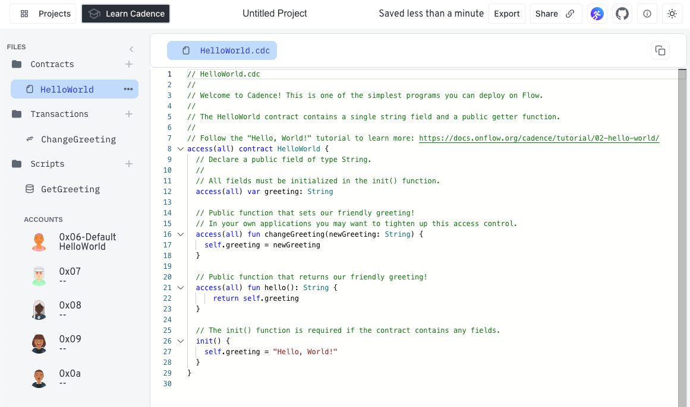

Welcome to our series of guides that get you up to speed on [Cadence] as quickly as possible! In this program, we jump right into making meaningful projects. Don't worry, we'll point you to the important parts of the language reference as each concept is introduced.

This series makes use of the [Flow Playground], an online IDE that enables you to easily write and test Cadence code in a simulated environment.

:::tip

If you already know Solidity, you might want to review the [Cadence Guide for Solidity Developers]. It compares the two languages and points out the most impactful differences from the perspective of a Solidity dev.

:::

## Objectives

After completing this tutorial, you'll be able to:

* Write, deploy, and interact with Cadence code in the Flow Playground.
* Select and utilize accounts in the Flow Playground.
* Run Cadence transactions and scripts from the playground.
* Explore the contracts and storage associated with test accounts.

## The Flow Developer Playground

The [Flow Playground] includes an in-browser editor and Flow emulator that you can use to experiment with Flow Cadence. Using the Flow Playground, you can write Cadence smart contracts, deploy them to a local Flow emulated blockchain, and submit transactions.

It has been primarily tested and optimized for Google Chrome, but other browsers should also work.

The playground comes pre-loaded with contract and transaction templates that correspond to each of the tutorials in this series. The tutorials also include a link (e.g., [https://play.flow.com/367d1462-f291-481f-aa14-02bb5ce3e897](https://play.flow.com/367d1462-f291-481f-aa14-02bb5ce3e897)), which opens the tutorial code in a new tab. The contracts, transactions, and scripts are loaded into the templates in the Playground for you to use. 

You'll need to navigate between the editor and this tutorial to read the instructions and make changes to your code.

## What is a smart contract?

In regular terms, a contract is an agreement between two parties to exchange information or assets. Normally, the terms of a contract are supervised and enforced by a trusted third party, such as a bank or a lawyer.

A smart contract is a computer program stored in a blockchain that verifies and executes the performance of a contract without the need for any trusted third party. The code itself is public and will perform all operations in an open, repeatable, and testable manner.

Programs that run on blockchains are commonly referred to as smart contracts because they facilitate important functions, such as managing digital currency, without relying on a central authority like a bank.

Flow can run smart contracts written in [Cadence] and older contracts written in Solidity on the [Flow EVM]. These guides focus on learning Cadence.

## Accounts

Accounts are the primary conduit for user interaction with on-chain code and assets. Users authorize transactions with their accounts and store their owned assets in their account storage.

:::warning

Flow is different from other blockchains in that contracts, assets, and information owned by a user or associated with their wallet address **are stored in the user's account**.

:::

We use the `warning` label above to get your attention, but this is a **good thing**! In most other chains, a coding error that accidentally changes a single number in a ledger can destroy, change, or duplicate ownership of an asset or assets. It's like a medieval shop with a bunch of paper IOUs having a gust of wind blow through vs. having the gold in your pocket.

The model of ownership in Cadence makes this kind of loss nearly impossible.

The Flow playground comes with pre-created accounts that you can use for testing and experimentation.

They're listed in the `Accounts` section on the bottom left part of the playground window.

You can click on a few of the accounts. They're empty when first created, but you'll see contracts and storage data here as you go through the tutorials.

## Contracts

The playground organizes contract source files under the `Contracts` folder in the nav panel on the left side of the window. Until deployed, these are source files not associated with an account or address.

### Deploying a contract

The default contract in a new playground session is a simple `HelloWorld` contract. To deploy:

1. Open the Cadence code in the account editor that contains a contract.
1. Click the `Deploy` button in the bottom-right of the screen to deploy that contract to the currently selected account.

<dl><dd><em>The contract deploys after a few seconds.</em></dd></dl>
1. Select `0x06-Default` in the **ACCOUNTS** list.

Here's what happens:

- The name of the contract and the block height it was deployed at appear in the list of `Deployed Contracts`.
- `FlowToken` objects are listed in the `Account Storage` section.
- Every Flow account is created with the ability to manage Flow Tokens.

## Scripts

In Cadence, scripts are simple, transaction-like snippets of code that you can use to **read** onchain data that is public.

To load a script, open the `GetGreeting` script and `Execute` it.

This script loads the instance of the `HelloWorld` contract you deployed with account `0x06` and returns the result of calling the `hello` function, which is the value stored onchain in the contract's `greeting` field.

You'll see the `result` logged in the console.

## Transactions

Cadence transactions are also written in Cadence.

### Executing a transaction

In the `Transactions` folder, you'll find an example of one:

1. Open the `ChangeGreeting` transaction.
1. Enter a new `greeting` and `Send` it. 
   - This executes a transaction to call `changeGreeting` and update the value in `greeting` for this specific instance of `HelloWorld`, deployed by address `0x06`.
   - Once the transaction completes, you'll see the output in the `Log` at the bottom of the window.
1. Open the `GetGreeting` script and `Execute` it again.

You'll now see your new greeting returned in the log!

## Say Hello, World!

You're now ready to write your own contract and say "Hello World!"

Now that you have completed the tutorial, you can:

* Write, deploy, and interact with Cadence code in the Flow Playground.
* Select and utilize accounts in the Flow Playground.
* Run Cadence transactions and scripts from the playground.
* Explore the contracts and storage associated with test accounts.

<!-- Relative links. Will not render on the page -->

[Cadence]: ../index.md
[Flow Playground]: https://play.flow.com
[Cadence Guide for Solidity Developers]: ../solidity-to-cadence.md
[Flow EVM]: https://developers.flow.com/evm/about
[Account Model]: ../docs/language/accounts/