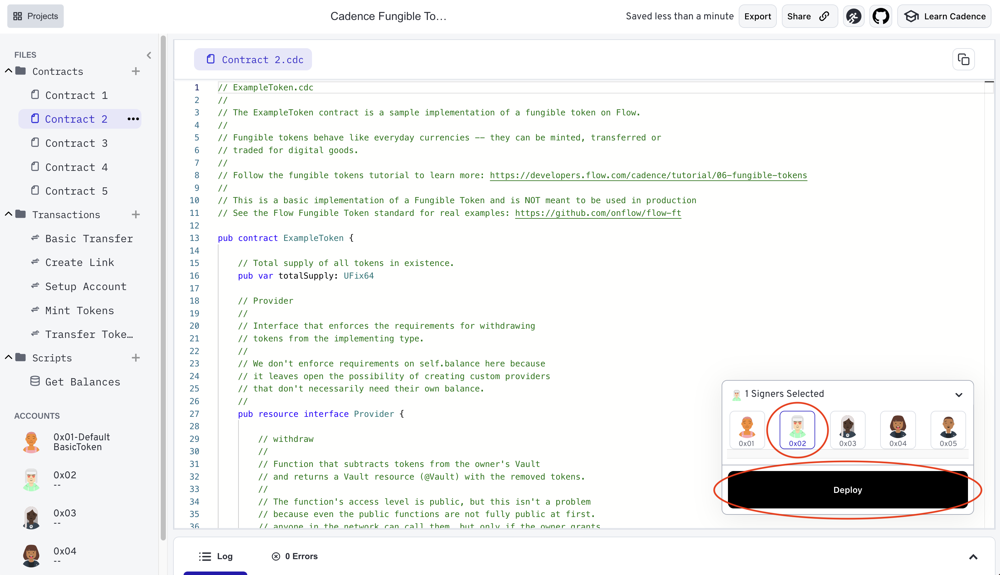

Some of the most popular contract classes on blockchains today are fungible tokens.
These contracts create homogeneous tokens that can be transferred to other users and spent as currency (e.g., ERC-20 on Ethereum).

In traditional software and smart contracts, balances for each user are tracked by a central ledger, such as a dictionary:

```cadence
// BAD CODE EXAMPLE. DO NOT USE THIS CODE FOR YOUR PROJECT
contract LedgerToken {
    // Tracks every user's balance
    access(contract) let balances: {Address: UFix64}

    // Transfer tokens from one user to the other
    // by updating their balances in the central ledger
    access(all)
    fun transfer(from: Address, to: Address, amount: UFix64) {
        balances[from] = balances[from] - amount
        balances[to] = balances[to] + amount
    }
}
```

With Cadence, we use the new resource-oriented paradigm to implement fungible tokens and avoid using a central ledger, because there are inherent problems with using a central ledger that are detailed in [the Fungible Tokens section below].

:::warning

This tutorial implements a working fungible token, but it has been simplified for educational purposes and is not what you should use in production. 

If you've found this tutorial looking for information on how to implement a real token, see the [Flow Fungible Token standard] for the standard interface and example implementation, and the [Fungible Token Developer Guide] for a details on creating a production ready version of a Fungible Token contract.

:::

In this tutorial, we're going to deploy, store, and transfer fungible tokens.

## Objectives

After completing this tutorial, you'll be able to:

* Compare and contrast how tokens are stored in Flow Cadence compared to Ethereum
* Utilize the `UFix64` type to allow decimals without converting back and forth with 10^18
* Implement a vault [resource] to manage the functionality needed for fungible tokens
* Use [interfaces] to enforce the presence of specified functions and fields
* Write transactions to transfer tokens safely from one account to another
* Develop scripts to read account balances

## Flow Network Token

In Flow, the [native network token (FLOW)] is implemented as a normal fungible token smart contract using a smart contract similar to the one you'll build in this tutorial.

There are special transactions and hooks that allow it to be used for transaction execution fees, storage fees, and staking, but besides that, developers and users are able to treat it and use it just like any other token in the network!

## Fungible Tokens on Flow

Flow implements fungible tokens differently than other programming languages. As a result:

* Ownership is decentralized and does not rely on a central ledger
* Bugs and exploits present less risk for users and less opportunity for attackers
* There is no risk of integer underflow or overflow
* Assets cannot be duplicated, and it is very hard for them to be lost, stolen, or destroyed
* Code can be composable
* Rules can be immutable
* Code is not unintentionally made public

### Fungible tokens on Ethereum

The example below showcases how Solidity (the smart contract language for the Ethereum Blockchain, among others) implements fungible tokens, with only the code for storage and transferring tokens shown for brevity.

```solidity ERC20.sol
contract ERC20 {
    // Maps user addresses to balances, similar to a dictionary in Cadence
    mapping (address => uint256) private _balances;

    function _transfer(address sender, address recipient, uint256 amount) {
        // ensure the sender has a valid balance
        require(_balances[sender] >= amount);

        // subtract the amount from the senders ledger balance
        _balances[sender] = _balances[sender] - amount;

        // add the amount to the recipient's ledger balance
        _balances[recipient] = _balances[recipient] + amount
    }
}
```

As you can see, Solidity uses a central ledger system for its fungible tokens. There is one contract that manages the state of the tokens and every time that a user wants to do anything with their tokens, they have to interact with the central ERC20 contract. This contract handles access control for all functionality, implements all of its own correctness checks, and enforces rules for all of its users.

If there's a bug, such as accidentally making the `_transfer` function public, an attacker can immediately exploit the entire contract and the tokens owned by all users.

### Intuiting Ownership with Resources

Instead of using a central ledger system, Flow utilizes a few different concepts to provide better safety, security, and clarity for smart contract developers and users.  Primarily, tokens are stored in each user's vault, which is a [resource] similar to the collection you created to store NFTs in the previous tutorial.  

This approach simplifies access control because instead of a central contract having to check the sender of a function call, most function calls happen on resource objects stored in users' accounts, and each user natively has sole control over the resources stored in their accounts.

This approach also helps protect against potential bugs. In a Solidity contract with all the logic and state contained in a central contract, an exploit is likely to affect all users who are involved in the contract.

In Cadence, if there is a bug in the resource logic, an attacker would have to exploit the bug in each token holder's account individually, which is much more complicated and time-consuming than it is in a central ledger system.

## Constructing a Vault

Our vault will be a simplified version of the one found in the [Flow Fungible Token standard].  We'll follow some of the same practices, including using [interfaces] to standardize the properties of our vault and make it easier for other contracts to interact with it.

:::info[Action]

Open the starter code for this tutorial in the Flow Playground:

<a
href="https://play.flow.com/65b44962-32c8-49c4-8a69-e96475d5a780"
target="_blank"
>
https://play.flow.com/65b44962-32c8-49c4-8a69-e96475d5a780
</a>

:::

In `ExampleToken.cdc`, you'll see:

```cadence ExampleToken.cdc
access(all) contract ExampleToken {

    access(all) entitlement Withdraw

    access(all) let VaultStoragePath: StoragePath
    access(all) let VaultPublicPath: PublicPath

   
    init() {
        self.VaultStoragePath = /storage/CadenceFungibleTokenTutorialVault
        self.VaultPublicPath = /public/CadenceFungibleTokenTutorialReceiver
    }
}
```

Before you can add your vault, you'll need to implement the various pieces it will depend on.

### Supply and Balance

The two most basic pieces of information for a fungible token are a method of tracking the balance of a given user, and the total supply for the token.  In Cadence, you'll usually want to use `UFix64` - a [fixed-point number].

Fixed-point numbers are essentially integers with a scale, represented by a decimal point.  They make it much easier to work with money-like numbers as compared to endlessly handling conversions to and from the 10^18 representation of a value.

:::info[Action]

Implement a contract-level [fixed-point number] to track the `totalSupply` of the token.

:::

```cadence
access(all) var totalSupply: UFix64
```

### Interfaces

You'll also need a place to store the `balance` of any given user's vault.  You **could** simply add a variable in the vault [resource] definition to do this and it would work just fine.  

Instead, let's use this opportunity to create some [interface]s.

In Cadence, interfaces are abstract types used to specify behavior in types that _implement_ the interface.  Using them helps compatibility and composability by breaking larger constructions down into standardized parts that can be used by more than one contract for more than one use case.  For example, the interface we'll create for `Receiver` is used by the vault, but it's also something you'd use for any other resource that needs to be able to receive tokens - such as a contract that pools a collection of tokens and splits them between several addresses.

You'll create three interfaces, to handle the three functional areas of the vault:

* A `Balance` interface for the balance of tokens stored in the vault
* A `Provider` interface that can provide tokens by withdrawing them from the vault
* A `Receiver` interface that can safely deposit tokens from one vault into another

:::info[Action]

First, create a `Balance` interface, requiring a public `UFix64` called `balance`.  It should be public.

:::

```cadence
access(all) resource interface Balance {
    access(all) var balance: UFix64
}
```

This one is pretty simple.  It just defines the type of variable anything implementing it will need to have to keep track of a token balance.

:::info[Action]

Next, create the `Provider` `interface`.  In it, define a `withdraw` function.  It should have the `Withdraw` access [entitlement], accept an argument for `amount`, and return a `Vault` resource type.  This should also be public.

To prevent an error, stub out the `Vault` resource as well.

:::

```cadence
access(all) resource interface Provider {
    access(Withdraw) fun withdraw(amount: UFix64): @Vault {}
}

access(all) resource Vault {}
```

This [interface] will require resources implementing it to have a `withdraw` function, but it doesn't provide any limitations to how that function works.  For example, it could be implemented such that the amount of tokens returned is double the withdrawn amount.  While there might be a use case for that effect, it's not what you want for a normal token standard.

You can allow for flexibility, such as allowing a `Provider` to select randomly from several vaults to determine the payer, while enforcing that the amount withdrawn is appropriate by adding a `post` condition to the function.  [Function preconditions and postconditions] can be used to restrict the inputs and outputs of a function.

In a postcondition, the special constant `result` is used to reference the `return` of the function.  They're written following the rules of [statements] and can contain multiple conditions.  Optionally, a `:` can be added after the last statement, containing an error message to be passed if the postcondition fails.

:::info[Action]

Add a `post` condition that returns a descriptive and nicely formatted error if the amount returned in the vault from the function doesn't match the `amount` passed into the function.

:::

```cadence
access(Withdraw) fun withdraw(amount: UFix64): @Vault {
    post {
        result.balance == amount:
            "ExampleToken.Provider.withdraw: Cannot withdraw tokens!"
            .concat("The balance of the withdrawn tokens (").concat(result.balance.toString())
            .concat(") is not equal to the amount requested to be withdrawn (")
            .concat(amount.toString()).concat(")")
    }
}
```

This `post` condition will be added automatically to the `withdraw` function in a resource implementing `Provider`.

:::info[Action]

Finally, implement an [interface] called `Receiver`, containing a function called `deposit` that accepts a `Vault`.

::

```cadence
access(all) resource interface Receiver {
    access(all) fun deposit(from: @Vault)
}
```

## Implementing the Vault

You're finally ready to implement the vault.

:::info[Action]

Start by declaring a type for a `Vault` that implements `Balance`, `Provider`, and `Receiver`.

:::

```cadence
access(all) resource Vault: Balance, Provider, Receiver {
    // TODO
}
```

You'll get errors:

```text
resource `ExampleToken.Vault` does not conform to resource interface `ExampleToken.Balance`. `ExampleToken.Vault` is missing definitions for members: Balance
```

And similar errors for `Provider` and `Receiver`.  Similar to inheriting from a virtual class in other languages, implementing the interfaces requires you to implement the properties from those interfaces in your resource.

:::info[Action]

Implement `balance`.  You'll also need to initialize it.  Initialize it with the `balance` passed into the `init` for the resource itself.

:::

The pattern we're setting up here let's us create vaults and give them a `balance` in one go.  Doing so is useful for several tasks, as creating a temporary `Vault` to hold a balance during a transaction also creates most of the functionality you need to do complex tasks with that balance.

For example, you might want to set up a conditional transaction that `deposit`s the balance in the vaults in different addresses based on whether or not a part of the transaction is successful.  

```cadence
access(all) var balance: UFix64

init(balance: UFix64) {
    self.balance = balance
}
```

:::info[Action]

Next, implement `withdraw` function.  It should contain a precondition that validates that the user actually possesses equal to or greater the number of tokens they are withdrawing.

:::

While this functionality is probably something we'd want in every vault, we can't put the requirement in the [interface], because the interface doesn't have access to the `balance`.

```cadence
access(Withdraw) fun withdraw(amount: UFix64): @Vault {
    pre {
        self.balance >= amount:
            "ExampleToken.Vault.withdraw: Cannot withdraw tokens! "
            .concat("The amount requested to be withdrawn (").concat(amount.toString())
            .concat(") is greater than the balance of the Vault (")
            .concat(self.balance.toString()).concat(").")
    }
    self.balance = self.balance - amount
    return <-create Vault(balance: amount)
}
```

:::info[Action]

Finally, implement the `deposit` function.  Depositing should move the entire balance from the provided vault, and then `destroy` it.

:::

```cadence
access(all) fun deposit(from: @Vault) {
    self.balance = self.balance + from.balance
    destroy from
}
```

You **must** do something with the `Vault` resource after it's moved into the function.  You can `destroy` it, because it's now empty, and you don't need it anymore.

### Vault Functions

We'll also need some functions to manage the vault itself.  

:::info[Action]

Add a function to `create` an empty `Vault`.

:::

```cadence
access(all) fun createEmptyVault(): @Vault {
    return <-create Vault(balance: 0.0)
}
```


### Transferring Tokens

When an account wants to send tokens to a different account, the sending account calls their own withdraw function first,
which subtracts tokens from their resource's balance and temporarily creates a new resource object that holds this balance:
```cadence
// Withdraw tokens from the signer's stored vault
let sentVault <- vaultRef.withdraw(amount: amount)
```

The sending account then calls the recipient account's deposit function, which literally moves the resource instance to the other account,
adds it to their balance, and then destroys the used resource:
```cadence
// Deposit the withdrawn tokens in the recipient's receiver
receiverRef.deposit(from: <-sentVault)
```

The resource needs to be destroyed because Cadence enforces strict rules around resource interactions.
A resource can never be left hanging in a piece of code. It either needs to be explicitly destroyed or stored in an account's storage.

When interacting with resources, you use the `@` symbol to specify the type, and a special “move operator” `<-`
when moving the resource, such as assigning the resource, when passing it as an argument to a function, or when returning it from a function.

```cadence
access(all) fun withdraw(amount: UInt64): @Vault {
```

This `@` symbol is required when specifying a resource **type** for a field, an argument, or a return value.
The move operator `<-` makes it clear that when a resource is used in an **assignment**, parameter, or return value,
it is moved to a new location and the old location is invalidated. This ensures that the resource only ever exists in one location at a time.

If a resource is moved out of an account's storage, it either needs to be moved to an account's storage or explicitly destroyed.

```cadence
destroy from
```

This rule ensures that resources, which often represent real value, do not get lost because of a coding error.

You'll notice that the arithmetic operations aren't explicitly protected against overflow or underflow.

```cadence
self.balance = self.balance - amount
```

In Solidity, this could be a risk for integer overflow or underflow, but Cadence has built-in overflow and underflow protection, so it is not a risk.
We are also using unsigned numbers in this example, so as mentioned earlier, the vault`s balance cannot go below 0.

Additionally, the requirement that an account contains a copy of the token's resource type in its storage
ensures that funds cannot be lost by being sent to the wrong address.

If an address doesn't have the correct resource type imported, the transaction will revert, ensuring that transactions sent to the wrong address are not lost.

**Important note: This protection is not in place for the Flow network currency,**
**because every Flow account is initialized with a default Flow Token Vault**
**in order to pay for [storage fees and transaction fees](https://developers.flow.com/build/basics/fees.md#fees).**

### Function Parameters

The line in `withdraw` that creates a new `Vault` has the parameter name `balance` specified in the function call.

```cadence
return <-create Vault(balance: amount)
```

This is another feature that Cadence uses to improve the clarity of code.
All function calls are required to specify the names of the arguments they are sending
unless the developer has specifically overridden the requirement in the funtion declaration.

### Perform a Basic Transfer

As we talked about above, a token transfer with resources is not a simple update to a ledger.
In Cadence, you have to first withdraw tokens from your vault, then deposit them to the vault
that you want to transfer to. We'll start a simple transaction that withdraws tokens from a vault
and deposits them back into the same vault.

:::info[Action]

Open the transaction named `Basic Transfer`.

`Basic Transfer` should contain the following code for withdrawing and depositing with a stored Vault:

:::

```cadence BasicTransfer.cdc
// Basic Transfer

import BasicToken from 0x06

// This transaction is used to withdraw and deposit tokens with a Vault

transaction(amount: UFix64) {

  prepare(signer: auth(BorrowValue) &Account) {

        // Get a reference to the signer's stored vault
        let vaultRef = signer.storage.borrow<auth(BasicToken.Withdraw) &BasicToken.Vault>
                       (from: BasicToken.VaultStoragePath)
            ?? panic("Could not borrow a vault reference to 0x06's BasicToken.Vault"
                     .concat(" from the path ")
                     .concat(BasicToken.VaultStoragePath.toString())
                     .concat(". Make sure account 0x06 has set up its account ")
                     .concat("with an BasicToken Vault."))

        // Withdraw tokens from the signer's stored vault
        sentVault <- vaultRef.withdraw(amount: amount)

        // Deposit the withdrawn tokens in the recipient's receiver
        vaultRef.deposit(from: <-sentVault)

        log("Withdraw/Deposit succeeded!")
    }
}
```

:::info[Action]

Select account `0x06` as the only signer.

You can enter any number less than 30.0 for the amount of tokens to transfer.

Click the `Send` button to submit the transaction.

This transaction withdraws tokens from the main vault and deposits them back
to it.

:::

This transaction is a basic example of a transfer within an account.
It withdraws tokens from the main vault and deposits back to the main vault.
It is simply to illustrate the basic functionality of how transfers work.

You'll see in this transaction that
you can borrow a reference directly from an object in storage.

```cadence
// Borrow a Withdraw reference to the signer's vault
// Remember to always have descriptive error messages!
let vaultRef = signer.storage.borrow<auth(BasicToken.Withdraw) &BasicToken.Vault>
                (from: ExampleToken.VaultStoragePath)
    ?? panic("Could not borrow a vault reference to 0x06's BasicToken.Vault"
            .concat(" from the path ")
            .concat(BasicToken.VaultStoragePath.toString())
            .concat(". Make sure account 0x06 has set up its account ")
            .concat("with an BasicToken Vault."))
```

This allows you to efficiently access objects in storage without having to load them,
which is a much more costly interaction.

This code also uses entitlements (`auth(BasicToken.Withdraw)`)
to access the withdraw functionality through a reference.
Without entitlements, any privileged functionality would be able to be accessed
via a public capability because reference can be downcasted to their concrete reference types.
Therefore, functions with privileged functionality, like `withdraw()` here,
should have entitlements in order to be secure.

In production code, you'll likely be transferring tokens to other accounts.
Capabilities allow us to accomplish this safely.

## Ensuring Security in Public: Capability Security

---

Another important feature in Cadence is its utilization of [**Capability-Based Security.**](../language/capabilities.md)

Cadence's security model ensures that objects stored in an account's storage can only be accessed by the account that owns them.
If a user wants to give another user access to their stored objects, they can link a public capability,
which is like an "API" that allows others to call specified functions on their objects.

An account only has access to the fields and methods of an object in a different account if they hold a capability to that object
that explicitly allows them to access those fields and methods with entitlements.

Only the owner of an object can create a capability for it and only the owner
can add entitlements to a capability.

Therefore, when a user creates a Vault in their account, they publish a capability
that exposes the `access(all)` fields and functions on the resource.
Here, those are `balance` and `deposit()`.

The withdraw function can remain hidden as a function that only the owner can call.

This removes the need to check the address of the account that made the function call
(`msg.sender` in Ethereum) for access control purposes, because this functionality
is handled by the protocol and the language's strong static type system.
If you aren't the owner of an object or don't have a valid reference to it
that was created by the owner, you cannot access the object at all!


## Create, Store, and Publish Capabilities and References to a Vault

---

Capabilities are kind of like pointers in other languages.
They are a link to an object in an account's storage
and can be used to read fields or call functions on the object they reference.
They cannot move or modify the object directly.

There are many different situations in which you would create a capability to your fungible token vault.
You might want a simple way to call methods on your `Vault` from anywhere in a transaction.
You could also send a capability that only exposes withdraw function in your `Vault` so that others can transfer tokens for you.

There could also be a function that takes a capability to a `Vault` as an argument, borrows a reference to the capability,
makes a single function call on the reference, then finishes and destroys the reference.

We already use this pattern in the `VaultMinter` resource in the `mintTokens` function, shown here:

```cadence
    // Function that mints new tokens and deposits into an account's vault
    // using their `{Receiver}` reference.
    // We say `&{Receiver}` to say that the recipient can be any resource
    // as long as it implements the Receiver interface
    access(all) fun mintTokens(amount: UFix64, recipient: Capability<&{Receiver}>) {
        let recipientRef = recipient.borrow()
        ?? panic("ExampleToken.VaultMinter.mintTokens: Could not borrow a receiver reference to "
                    .concat("the specified recipient's ExampleToken.Vault"))
                    .concat(". Make sure the account has set up its account ")
                    .concat("with an ExampleToken Vault and valid capability."))

        ExampleToken.totalSupply = ExampleToken.totalSupply + UFix64(amount)
        recipientRef.deposit(from: <-create Vault(balance: amount))
    }
```

The function takes a capability as an argument.
This syntax might be unclear to you:

```cadence
recipient: Capability<&{Receiver}>
```

This means that `recipient` has to be a Capability that was created as the type contained in `<>`.
The type outside of the curly braces `{}` has to be a concrete type
and the type in the curly braces has to be an interface type.
Here we are saying that the type can be any resource that implements the `ExampleToken.Receiver` interface.
If that is true, this function borrows a reference from this capability
and uses the reference to call the `deposit` function of that resource because we know that
the `deposit` function will be there since it is in the `ExampleToken.Receiver` interface.

Let's create capabilities to your `Vault` so that a separate account can send tokens to you.

:::info[Action]

Before we submit a transaction interacting with ExampleToken resources, we'll need to deploy the contract to account `0x07`:

1. Select `ExampleToken` in the playground sidebar
2. Make sure that signer `0x07` is selected as the deploying address
3. Click "Deploy"

:::



Now we can continue on to configure Capabilities on the ExampleToken Vault.

:::info[Action]

Open the transaction named `Issue Capability`.

`Issue Capability` should contain the following code for creating a reference to the stored Vault:

:::

```cadence issue_capability.cdc
import ExampleToken from 0x07

// This transaction creates a capability
// that is linked to the account's token vault.
// The capability is restricted to the fields in the `Receiver` interface,
// so it can only be used to deposit funds into the account.
transaction {
  prepare(signer: auth(IssueStorageCapabilityController, PublishCapability) &Account) {

    // Create a link to the Vault in storage that is restricted to the
    // fields and functions in `Receiver` and `Balance` interfaces,
    // this only exposes the balance field
    // and deposit function of the underlying vault.
    let receiverCap = signer.capabilities.storage.issue<&{ExampleToken.Receiver, ExampleToken.Balance}>(
        ExampleToken.VaultStoragePath
    )
    signer.capabilities.publish(receiverCap, at: ExampleToken.VaultPublicPath)

    log("Public Receiver reference created!")
  }

  post {
    // Check that the capabilities were created correctly
    // by getting the public capability and checking
    // that it points to a valid `Vault` object
    // that implements the `Receiver` interface
    getAccount(0x07).capabilities.get<&{ExampleToken.Receiver}>(ExampleToken.VaultPublicPath)
                    .check():
                    "Vault Receiver Reference was not created correctly"
    }
}
```

In order to use a capability, we have to first issue a link to that object in storage.
A reference can then be created from a capability, and references cannot be stored.
They need to be lost at the end of a transaction execution.

To create a capability, we use the `account.capabilities.issue` function.

```cadence
// Create a capability to the Vault in storage that is restricted to the
// fields and functions in `Receiver` and `Balance` interfaces,
// this only exposes the balance field
// and deposit function of the underlying vault.
//
let receiverCap = signer.capabilities.storage.issue<&ExampleToken.Vault>(
    ExampleToken.VaultStoragePath
)
signer.capabilities.publish(receiverCap, at: ExampleToken.VaultPublicPath)
```

`issue` creates a new capability that is targeting the storage `target` in the second argument.
The type restriction for the link is specified in the `<>`. We use `&{ExampleToken.Receiver, ExampleToken.Balance}`
to say that the link can be any resource as long as it implements and is cast as the Receiver interface.
This is the common format for describing references.
You first have a `&` followed by the concrete type, then the interface in curly braces to ensure that
it is a reference that implements that interface and only includes the fields specified in that interface.

We publish the capability in `ExampleToken.VaultPublicPath` because we want it to be publicly accessible.
The `public` domain of an account is accessible to anyone in the network via an account's
public `&Account` reference, which is fetched by using the `getAccount(address)` function.

Next is the `post` phase of the transaction.

```cadence
post {
// Check that the capabilities were created correctly
// by getting the public capability and checking
// that it points to a valid `Vault` object
// that implements the `Receiver` interface
getAccount(0x07).capabilities.get<&{ExampleToken.Receiver}>(ExampleToken.VaultPublicPath)
                    .check():
                    "Vault Receiver Reference was not created correctly"
}
```

The `post` phase is for ensuring that certain conditions are met after the transaction has been executed.
Here, we are getting the capability from its public path and calling its `check` function to ensure
that the capability contains a valid link to a valid object in storage that is the specified type.

:::info[Action]

Now that we understand the transaction, time to submit it:

1. Select account `0x07` as the only signer.
2. Click the `Send` button to submit the transaction.
3. This transaction creates a new public capability to your `Vault`
   and checks that it was created correctly.

:::

## Transfer Tokens to Another User

---

Now, we are going to run a transaction that sends 10 tokens to account `0x08`.
We will do this by calling the `withdraw` function on account `0x07`'s Vault,
which creates a temporary Vault object for moving the tokens,
then deposits those tokens into account `0x08`'s vault by calling the `deposit` function on their vault.

:::info[Action]

Account `0x08` has not been set up to receive tokens, so we will do that now:

1. Open the transaction `Setup Account`.
2. Select account `0x08` as the only signer.
3. Click the `Send` button to set up account `0x08` so that it can receive tokens.

:::

```cadence SetupAccount.cdc
// Setup Account

import ExampleToken from 0x07

// This transaction configures an account to store and receive tokens defined by
// the ExampleToken contract.
transaction {
    prepare(signer: auth(BorrowValue, IssueStorageCapabilityController, PublishCapability, SaveValue) &Account) {
        // Create a new empty Vault object
        let vaultA <- ExampleToken.createEmptyVault()

        // Create a new ExampleToken Vault and put it in storage
        signer.storage.save(<-vaultA, to: ExampleToken.VaultStoragePath)

        log("Empty Vault stored")

        // Create a public Receiver capability to the Vault
        let receiverCap = signer.capabilities.storage.issue<&ExampleToken.Vault>(
            ExampleToken.VaultStoragePath
        )
        signer.capabilities.publish(receiverCap, at: ExampleToken.VaultPublicPath)

        log("References created")
    }

    post {
        getAccount(0x08).capabilities.get<&{ExampleToken.Receiver}>(ExampleToken.VaultPublicPath)
                            .check():
                            "Vault Receiver Reference was not created correctly"
    } 
}
```

Here we perform the same actions that account `0x07` did to set up its `Vault`, but all in one transaction.
Account `0x08` is ready to start building its fortune! As you can see, when we created the Vault for account `0x08`,
we had to create one with a balance of zero by calling the `createEmptyVault()` function.
Resource creation is restricted to the contract where it is defined, so in this way, the Fungible Token smart contract can ensure that
nobody is able to create new tokens out of thin air.

As part of the initial deployment process for the ExampleToken contract, account `0x07` created a `VaultMinter` object.
By using this object, the account that owns it can mint new tokens.
Right now, account `0x07` owns it, so it has sole power to mint new tokens.
We could have had a `mintTokens` function defined in the contract,
but then we would have to check the sender of the function call to make sure that they are authorized,
which is not the recommended way to perform access control in Cadence.

As we explained before, the resource model plus capability security
handles this access control for us as a built in language construct
instead of having to be defined in the code.
If account `0x07` wanted to authorize another account to mint tokens,
they could either move the `VaultMinter` object to the other account,
or give the other account a private capability to the single `VaultMinter`.
Or, if they didn't want minting to be possible after deployment,
they would simply mint all the tokens at contract initialization
and not even include the `VaultMinter` in the contract.

In the next transaction, account `0x07` will mint 30 new tokens and deposit them into account `0x08`'s newly created Vault.

:::info[Action]

1. Open the `Mint Tokens` transaction.
2. Select only account `0x07` as a signer and send `Mint Tokens` to mint 30 tokens for account `0x08`.

:::

`Mint Tokens` should contain the code below.

```cadence mint_tokens.cdc
// Mint Tokens

import ExampleToken from 0x07

// This transaction mints tokens and deposits them into account 3's vault
transaction {

    // Local variable for storing the reference to the minter resource
    let mintingRef: &ExampleToken.VaultMinter

    // Local variable for storing the reference to the Vault of
    // the account that will receive the newly minted tokens
    var receiver: Capability<&{ExampleToken.Receiver}>

	prepare(signer: auth(BorrowValue) &Account) {
        // Borrow a reference to the stored, private minter resource
        self.mintingRef = signer.storage.borrow<&ExampleToken.VaultMinter>(from: /storage/CadenceFungibleTokenTutorialMinter)
            ?? panic("Could not borrow a reference to the signer's ExampleToken.VaultMinter"
                     .concat(" from the path /storage/CadenceFungibleTokenTutorialMinter")
                     .concat(". Make sure you have deployed ExampleToken to 0x07 ")
                     .concat("and are signing with account 0x07."))

        // Get the public account object for account 0x08
        let recipient = getAccount(0x08)

        // Get their public receiver capability
        self.receiver = recipient.capabilities.get<&{ExampleToken.Receiver}>
(ExampleToken.VaultPublicPath)

	}

    execute {
        // Mint 30 tokens and deposit them into the recipient's Vault
        self.mintingRef.mintTokens(amount: 30.0, recipient: self.receiver)

        log("30 tokens minted and deposited to account 0x08")
    }
}
```

This is an example of a transaction where we utilize local transaction variables
that span different stages in the transaction.
We declare the `mintingRef` and `receiverRef` variables outside of the prepare stage
but must initialize them in `prepare`.
We can then use them in later stages in the transaction.

Then we borrow a reference to the `VaultMinter`. We specify the borrow as a `VaultMinter` reference
and have the reference point to `/storage/CadenceFungibleTokenTutorialMinter`.
The reference is borrowed as an optional so we use the nil-coalescing operator (`??`) to make sure the value isn't `nil`.
If the value is `nil`, the transaction will execute the code after the `??`.
The code is a panic, so it will revert and print the descriptive error message.

You can use the `getAccount()` built-in function to get any account's public account object.
The public account object lets you get capabilities from the `public` domain of an account, where public capabilities are stored.

We use the `account.capabilities.get` function to get the public capability from a public path.

```cadence
// Get the public receiver capability
let cap = recipient.capabilities.get(ExampleToken.VaultPublicPath)
```

In the execute phase, we simply use the reference to mint 30 tokens and deposit them into the `Vault` of account `0x08`.

## Check Account Balances

Now, both account `0x07` and account `0x08` should have a `Vault` object in their storage that has a balance of 30 tokens.
They both should also have a `Receiver` capability stored in their `/public/` domains that links to their stored `Vault`.


An account cannot receive any token type unless it is specifically configured to accept those tokens.
As a result, it is difficult to send tokens to the wrong address accidentally.
But, if you make a mistake setting up the `Vault` in the new account, you won't be able to send tokens to it.

Let's run a script to make sure we have our vaults set up correctly.

You can use scripts to access an account's public state. Scripts aren't signed by any account and cannot modify state.

In this example, we will query the balance of each account's vault. The following will print out the balance of each account in the emulator.

:::info[Action]

Open the script named `Get Balances` in the scripts pane.

:::

`Get Balances` should contain the following code:

```cadence get_balances.cdc
// Get Balances

import ExampleToken from 0x07

// This script reads the Vault balances of two accounts.
access(all)
fun main() {
    // Get the accounts' public account objects
    let acct7 = getAccount(0x07)
    let acct8 = getAccount(0x08)

    // Get references to the account's receivers
    // by getting their public capability
    // and borrowing a reference from the capability
    let acct7ReceiverRef = acct7.capabilities.get<&{ExampleToken.Balance}>(ExampleToken.VaultPublicPath)
                            .borrow()
            ?? panic("Could not borrow a balance reference to "
                     .concat("0x07's ExampleToken.Vault")
                     .concat(". Make sure 0x07 has set up its account ")
                     .concat("with an ExampleToken Vault and valid capability."))

    let acct8ReceiverRef = acct8.capabilities.get<&{ExampleToken.Balance}>(ExampleToken.VaultPublicPath)
                            .borrow()
            ?? panic("Could not borrow a balance reference to "
                     .concat("0x08's ExampleToken.Vault")
                     .concat(". Make sure 0x08 has set up its account ")
                     .concat("with an ExampleToken Vault and valid capability."))

    // Use optional chaining to read and log balance fields
    log("Account 0x07 Balance")
	  log(acct7ReceiverRef.balance)
    log("Account 0x08 Balance")
    log(acct8ReceiverRef.balance)
}
```

:::info[Action]

Execute `Get Balances` by clicking the Execute button.

:::

This should ensure the following:

- Account `0x07`'s balance is 30
- Account `0x08`'s balance is 30

If correct, you should see the following lines:

```
"Account 1 Balance"
30
"Account 2 Balance"
30
Result > "void"
```

If there is an error, this probably means that you missed a step earlier
and might need to restart from the beginning.

To restart the playground, close your current session and open the link at the top of the tutorial.

Now that we have two accounts, each with a `Vault`, we can see how they transfer tokens to each other!

:::info[Action]

1. Open the transaction named `Transfer Tokens`.
2. Select account `0x08` as a signer and send the transaction.
3. `Transfer Tokens` should contain the following code for sending tokens to another user:

:::

```cadence transfer_tokens.cdc
// Transfer Tokens

import ExampleToken from 0x07

// This transaction is a template for a transaction that
// could be used by anyone to send tokens to another account
// that owns a Vault
transaction {

  // Temporary Vault object that holds the balance that is being transferred
  var temporaryVault: @ExampleToken.Vault

  prepare(signer: auth(BorrowValue) &Account) {
    // withdraw tokens from your vault by borrowing a reference to it
    // and calling the withdraw function with that reference
    let vaultRef = signer.storage.borrow<auth(ExampleToken.Withdraw) &ExampleToken.Vault>(from: ExampleToken.VaultStoragePath)
        ?? panic("Could not borrow a vault reference to 0x08's ExampleToken.Vault"
                    .concat(" from the path ")
                    .concat(ExampleToken.VaultStoragePath.toString())
                    .concat(". Make sure account 0x06 has set up its account ")
                    .concat("with an ExampleToken Vault."))

    self.temporaryVault <- vaultRef.withdraw(amount: 10.0)
  }

  execute {
    // get the recipient's public account object
    let recipient = getAccount(0x07)

    // get the recipient's Receiver reference to their Vault
    // by borrowing the reference from the public capability
    let receiverRef = recipient.capabilities.get<&{ExampleToken.Receiver}>(ExampleToken.VaultPublicPath)
                      .borrow()
            ?? panic("Could not borrow a receiver reference to "
                     .concat("0x07's ExampleToken.Vault")
                     .concat(". Make sure 0x07 has set up its account ")
                     .concat("with an ExampleToken Vault and valid capability."))

    // deposit your tokens to their Vault
    receiverRef.deposit(from: <-self.temporaryVault)

    log("Transfer succeeded!")
  }
}

```

In this example, the signer withdraws tokens from their `Vault` using an **entitled reference**,
which creates and returns a temporary `Vault` resource object with `balance=10`
that is used for transferring the tokens. In the execute phase,
the transaction moves that resource to another user's `Vault` using their `deposit` method.
The temporary `Vault` is destroyed after its balance is added to the recipient's `Vault`.

You might be wondering why we have to use two function calls to complete a token transfer when it is possible to do it in one.
This is because of the way resources work in Cadence.
In a ledger-based model, you would just call transfer, which just updates the ledger,
but in Cadence, the location of the tokens matters,
and therefore most token transfer situations will not just be a direct account-to-account transfer.

Most of the time, tokens will be used for a different purpose first,
like purchasing something, and that requires the `Vault` to be separately sent
and verified before being deposited to the storage of an account.

Separating the two also allows us to take advantage of being able
to statically verify which parts of accounts can be modified in the `prepare` section of a transaction,
which will help users have peace of mind when getting fed transactions to sign from an app.

:::info[Action]

Execute `Get Balances` again.

:::

If correct, you should see the following lines indicating that account `0x07`'s balance is 40 and account `0x08`'s balance is 20:

```
"Account 2 Balance"
40
"Account 3 Balance"
20
Result > "void"
```

You now know how a basic fungible token is used in Cadence and Flow!

From here, you could try to extend the functionality of fungible tokens by making:

- A faucet for these tokens
- An escrow that can be deposited to (but only withdrawn when the balance reaches a certain point)
- A function to the resource that mints new tokens!

## Create a Flow Marketplace

---

Now that you have an understanding of how fungible tokens work on Flow and have a working NFT, you can learn how to create
a marketplace that uses both fungible tokens and NFTs. Move on to the next tutorial to learn about Marketplaces in Cadence!


<!-- Reference-style links, do not render on page -->

[resource]: ../language/resources.mdx
[interfaces]: ../language/interfaces.mdx
[native network token (FLOW)]: https://github.com/onflow/flow-core-contracts/blob/master/contracts/FlowToken.cdc
[Flow Fungible Token standard]: https://github.com/onflow/flow-ft
[Fungible Token Developer Guide]: https://developers.flow.com/build/guides/fungible-token
[resource]: ../language/resources.mdx
[resources]: ../language/resources.mdx
[fixed-point number]: ../language/values-and-types.mdx#fixed-point-numbers
[entitlement]: ../language/access-control.md
[Function preconditions and postconditions]: ../language/functions.mdx#function-preconditions-and-postconditions
[statements]: ../language/syntax.md#semicolons
