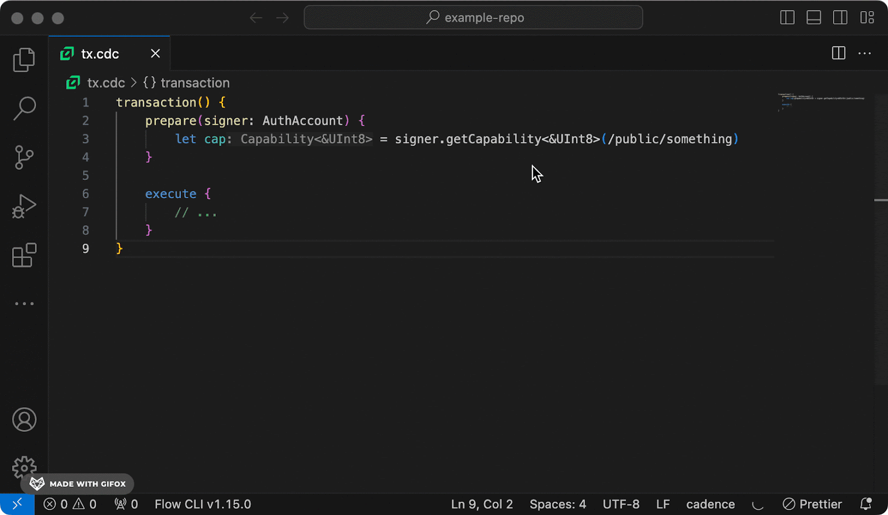

This upgrade roadmap offers developers guidance, actionable steps, and expectations around updating your project to be compatible with Cadence 1.0.

The Cadence 1.0 release is a breaking change – developers need to update all Cadence code used by their app (including all existing smart contracts deployed on Flow) to Cadence 1.0, to ensure it continues to work after the network upgrade.

Many of the improvements of Cadence 1.0 fundamentally change how Cadence works and is used. However, that also means it is necessary to break existing code to release this version, which will guarantee stability (no more planned breaking changes) going forward.

### Benefits of Cadence 1.0

[Cadence 1.0](https://flow.com/upgrade/crescendo/cadence-1) is the latest version of the Cadence smart contract programming language. The stable release of Cadence 1.0 represents a significant milestone in the language’s maturity, delivering a comprehensive suite of improvements that increase speed, security and efficiency. With Cadence 1.0, developers gain access to over 20 new features and enhancements. Each change is thoughtfully designed to streamline workflows, reduce duplication and improve code readability, making writing and understanding smart contracts much easier.

### Staging and State Migration Process

The migration to Crescendo requires developers to adapt their code for compatibility with the latest Cadence 1.0 updates, a process that involves rewriting contracts and ‘staging’ them against the currently deployed versions. The new staging mechanism is run via a Flow CLI command. Staged code swaps and replaces deployed code at the time of the upgrade, contracts not updated by this time will cease to function.

To make the migration process smooth, new tools, testing environments, and networks have been introduced. Previewnet, is a temporary network featuring the upgraded core contracts and Cadence 1.0 language features, it’s designed for experimentation and not involved in the staging process. Additionally, for both Testnet and Mainnet, "Migration Environment" networks will be created which fork all staged contracts, and their dependencies along with their data and state. These migration environments are reset weekly, pulling in any newly staged contracts, static analysis typechecker reports will also be published on all staged contracts that were not updated correctly.

The Testnet Migration environment is estimated to become available April 3rd and the Mainnet Migration environment is scheduled for mid year.

Help is available during the [Cadence 1.0 Office Hours](https://calendar.google.com/calendar/ical/c_47978f5cd9da636cadc6b8473102b5092c1a865dd010558393ecb7f9fd0c9ad0%40group.calendar.google.com/public/basic.ics) each week at 10:00am PST on the Flow Developer Discord.

#### Expectations

- Any contracts that are not upgraded will fail after Testnet and Mainnet upgrade.
- After the Testnet upgrade, Cadence versions will differ on Testnet (v1.0) and Mainnet (v0.42).
- Developers must take extra considerations if they wish to continue deploying on the mainnet during this period. Otherwise, incompatibilities between different Cadence versions will lead to failed deployments.

## Developer Steps to Upgrade

_What you need to do you and when you need to do it_

1. **Understand the Changes:** Start by familiarizing yourself with the changes to identify how they might affect your code.
2. **Modify Your Code:** Update your contracts, transactions, and scripts in accordance with the new changes.
3. **Test Your Code:** The latest emulator release includes all updated standards and core contracts. You should test your code changes locally and additionally on the Crescendo Previewnet and/or Testnet. You can also prepare for the Mainnet Migration, by simulating staging and state migration on the Flow Emulator.
4. **Stage your Contracts for Migration:** The last step is to get your updated code ready to replace your live pre-cadence 1.0 code when the upgrade occurs, to do this you need to stage your contracts. Stage them on testnet and ensure that they are working as expected along with their staged dependencies. Staging for mainnet contracts is coming soon.

## Developer Milestones

Under each Milestone breakdown we include the steps you need to take, the tools and reference materials available (or planned) and an estimate of time/resources commitment for each step.

|               |                                                                                           |                                                                                                          |              |                             |                                                                             |
| ------------- | ----------------------------------------------------------------------------------------- | -------------------------------------------------------------------------------------------------------- | ------------ | --------------------------- | --------------------------------------------------------------------------- |
| **Milestone** | **Overview**                                                                              | **Description**                                                                                          | **Dates**    | **Developer Time estimate** | **Requirements**                                                            |
| 1             | [Update and Test Your Code](#update-and-test-your-code)                                   | Update your code (contracts, scripts, transactions, and event listeners) and test on Emulator/Previewnet | Ongoing      | \~ 1-2 weeks                | Cadence 1.0 documentation, CLI/Emulator support for Cadence 1.0, Previewnet |
| 2             | [Perform Local Staging/Migration Testing](#perform-local-stagingmigration-testing)        | Test contract staging and state migration on Emulator                                                    | Ongoing      | \~ 2-5 days                 | CLI Emulator support for staging, state migration                           |
| 3             | [Stage and Confirm on Testnet Migration Env](#stage-and-confirm-on-mainnet-migration-env) | Test contract staging and state migrations on Testnet Migration Environment                              | April 1 - ?  | \~ 1 Week (Stage/QA)        | Flow CLI, Testnet Migration Environment                                     |
| 4             | [Stage and Confirm on Mainnet Migration Env](#stage-and-confirm-on-mainnet-migration-env) | Test contract staging and state migrations on Mainnet Migration Environment                              | April 15 - ? | \~ 1 Week (Stage/QA)        | Flow CLI, Mainnet Migration Environment                                     |
| 5             | Mainnet Migration                                                                         | Mainnet Migration                                                                                        | ?            | n/a                         | All contracts staged to Mainnet                                             |

## Update and Test Your Code

_Estimated Time Required: **~1-2 Weeks**_

### Review The Cadence 1.0 Breaking Improvements and Upgrade Plan

In order to determine the changes needed for your application, you’ll first need to familiarize yourself with Cadence 1.0 breaking improvements, code updates, and the planned upgrade process.

- Learn how Cadence will be changing for 1.0
- Understand the upgrade, the timeline, and how it affects you
- Check out the Cadence Language 1.0 docs

Once you understand what changes are required for your app, you can use the Cadence 1.0 CLI to update, test, and run your upgraded code. Ensure to update and test all your contracts, transactions, scripts and event listeners to valid Cadence 1.0 code.

:::warning
**IMPORTANT NOTE ABOUT AVOIDING CHANGES IN BUSINESS LOGIC**

- The on-chain data migration logic relies on assumption that the updated contracts uploaded by dapp developers limits updates to the minimum changes required by the Cadence 1.0 version - in other words, the updated contract should be behaviour-preserving.
- If the contract upgrade to Cadence 1.0 also includes changes to business logic, the on-chain data migration won’t work as expected and might result in security vulnerabilities in the migrated on-chain data.
  :::

### Install Cadence 1.0 CLI

This [video guide](https://www.loom.com/share/4467610b7beb4ebbaabed6b430dc25c4?sid=14ecb3e7-e933-409c-a6a4-add40c6971d0) demonstrates how to install the pre-release version of Flow CLI and start working towards a feature branch that is Cadence 1.0 compatible.

Run the following command to install the CLI version with support for Cadence 1.0.

- Linux/MacOS: `sudo sh -ci "$(curl -fsSL https://raw.githubusercontent.com/onflow/flow-cli/feature/stable-cadence/install.sh)"`
- Windows: `iex "& { $(irm 'https://raw.githubusercontent.com/onflow/flow-cli/feature/stable-cadence/install.ps1') }"`

The Cadence 1.0 CLI will now be installed on your machine and can be accessed via the flow-c1 command. To verify the installation, run: `flow-c1 version`

Additionally you can use the [Cadence VSCode Extension](https://developers.flow.com/tools/vscode-extension), [Cadence Linter](https://developers.flow.com/tools/flow-cli/lint), and [Chat GPT Flow Migration Assistant](https://chat.openai.com/g/g-lt4a6jvfj-flow-cadence-1-0-migration-helper) to help identify sections of code which must be migrated to Cadence 1.0, view details about what must change as well as suggested fixes for straightforward migrations.

### Using Cadence 1.0 in VSCode

The [Cadence VSCode Extension](https://marketplace.visualstudio.com/items?itemName=onflow.cadence) now supports Cadence 1.0. Instantly identify and learn about all the changes you need to make to become Crescendo ready.



### Test Code Changes on Crescendo Previewnet

Crescendo Previewnet is Flow's official testing and development network. It is intended to provide a testing environment for app developers. It aims to balance similarity with Mainnet with being a productive development environment with two key differences:

1. Faster block rate
2. Shorter epochs (~12 hours)

Crescendo Previewnet is available for access at the following URLs:

- GRPC: `access.previewnet.nodes.onflow.org:9000`
- REST: `https://rest-previewnet.onflow.org`

1. Generate a new key pair with the Flow CLI
2. Fund your account with [Previewnet Faucet](https://previewnet-faucet.onflow.org/fund-account) - If you generated the keypair through the CLI, you can click on the URL provided to create an account and request crescendo FLOW tokens.
3. Use **Flow Reference Wallet (Chrome Extension)** which provides support for Crescendo Previewnet
   1. Install [Flow Wallet Chrome Extension](https://chromewebstore.google.com/detail/flow-reference-wallet/hpclkefagolihohboafpheddmmgdffjm) from Chrome Web Store
   2. Navigate to settings
   3. Enable "Developer Mode"
   4. Select Previewnet
4. Use [FlowDiver](https://previewnet.flowdiver.io/), the Flow Blockchain Explorer to review analytics, transactions, block, account and contract information for Previewnet.

### Upgrading NFT and FT Contracts

In addition to changes to the Cadence programming language, the Cadence token standards are also being streamlined and improved. All NFTs and FTs will also need to prepare and migrate their existing Cadence smart contracts, scripts, and transactions for the update. If you do not update your code, your applications will become non-functional after the network upgrade.

#### NFT Standard v2

[This document](./nft-guide.mdx) describes the changes to the Cadence Non-Fungible Token (NFT) standard and gives a step-by-step guide for how to upgrade your NFT contract from Cadence 0.42 to Cadence 1.0.

#### FT Standard v2

[This document](./ft-guide.mdx) describes the changes to the Cadence Non-Fungible Token (NFT) standard and gives a step-by-step guide for how to upgrade your NFT contract from Cadence 0.42 to Cadence 1.0.

## Perform Local Staging/Migration Testing

_Estimated Time Required: **~1 Day**_

[Review the documentation](https://developers.flow.com/tools/flow-cli/migrate/migrate-stage-contract) and use Flow CLI to test staging and state migration locally.

```bash
// Stage a Cadence 1.0 supported contract project using the Flow CLI.
$ flow migrate stage-contract <contract_name>
Arguments: contract_name
Valid Input: Existing contract name in flow.json.

// Unstage a Cadence 1.0 supported contract project using the Flow CLI.
$ flow migrate unstage-contract <contract_name>
Arguments: contract_name
Valid Input: Existing contract name in flow.json.

// Check to see if a contract has been staged from the Flow CLI
$ flow migrate is_staged <contract_name>
Arguments: contract_name
Valid Input: Existing contract name in flow.json.

// Get the staged contract code from a contract that's been correctly staged.
$ flow migrate staged_code <contract_name>
Arguments: contract_name
Valid Input: Existing contract name in flow.json.
```

### Test Local State Migration

Flow CLI provides the `flow migrate state` command to migrate your local emulator state to Cadence 1.0, and to deploy upgraded contracts to the emulator. This is useful for locally testing the staged contract upgrades, and to see how the new network and the upgraded contracts would behave with the migrated data.

To test the migration, first you would need an emulator state, created with an emulator/CLI release that uses a pre-1.0 Cadence version. It is recommended to use the latest pre-1.0 CLI version (e.g: v1.17.0) for creating the old state.

1. **Get Emulator State**
   1. To get an emulator state with Flow CLI 1.17.0, start the emulator with the `--persist` flag (e.g. `flow emulator --persist`)
   2. Deploy the pre-1.0 project/contracts to the emulator
   3. Run transactions if there are any.
   4. Stop the emulator (Ctrl-C on \*nix platforms, and Ctrl-Break or Ctrl-Pause on Windows). It is important to make sure the emulator is stopped before taking the snapshot, so that any pending in-memory data would be written to the persisted state properly.
   5. Locate the persisted state ./flowdb/emulator.sqlite file, from the project root.
2. **Migrate**
   1. Download and install the latest CLI, that runs Cadence 1.0.
   2. Run `flow-c1 migrate` against the previously created state. The state file (emulator.sqlite) can be provided using the `--db-path` flag.
   3. If there are any contracts that also need to be upgraded, those can be specified using the `--contracts` flag. Note that, the paths to these updated contracts and their deployed addresses must be specified in the flow.json file. (see (Flow CLI documentation about contract deployments)[https://developers.flow.com/tools/flow-cli/deployment/project-contracts#define-contract-deployment-targets] for more info)
   4. A sample migrate command would look like:
      `flow-c1 migrate state --db-path=/path/to/emulator.sqlite --save-report=./reports --contracts="Test"`
3. **Testing the Migrated State**
   Once the migration is completed successfully, the emulator can be started with the migrated state. For that, ensure the emulator is started again using the new CLI version (that runs Cadence 1.0), with the `--persist` flag. Now the emulator should be up and running using the migrated state and the updated contracts.

Run any transactions to verify the correctness of the existing data.

## Stage and Confirm on Testnet Migration Env

_Estimated Time Required: **~1 Week**_

Beginning approximately April 3, 2024, the Flow team will trigger migration of contracts that were staged for upgrade, run all Cadence 1.0 migrations and restart the network. This completes the first full upgrade process to Cadence 1.0. The next milestone repeats this process on Mainnet. This step creates a fully working “real” environment, where developers can test their apps interaction with other contracts and projects available on Crescendo network. The Flow team may repeat this step multiple times (resetting the Crescendo network to pre-upgrade state and performing the upgrade again) to fix issues found during the upgrade process.

In order to migrate your updated smart contract to Cadence 1.0, it's crucial to stage it on the Testnet network. This preliminary step not only verifies the contract's compatibility and syntactical correctness but also ensures a seamless transition to the new environment.

Use the CLI to stage your contracts to Testnet Migration Environment for state migration testing. Automatic state migrations will happen several times over the Testnet Migration Environment testing period on a weekly cadence.

```bash
// Stage a Cadence 1.0 supported contract project using the Flow CLI.
$ flow migrate stage-contract <contract_name> --network=testnet
Arguments: contract_name
Valid Input: Existing contract name in flow.json.

// Check to see if a contract has been successfully staged on Testnet.
$ flow migrate is_staged <contract_name> --network=testnet
Arguments: contract_name
Valid Input: Existing contract name in flow.json.
// Lists all Cadence 1.0 supported contracts that are staged on Testnet.
$ flow migrate list-staged --network --network=testnet
Arguments: network_name
```

### Stage and Confirm on Mainnet Migration Env

_Estimated Time Required: **~1 Week**_

:::warning
**IMPORTANT NOTE ABOUT STAGING YOUR CONTRACTS FOR UPGRADE**

Developers must stage their contracts to be upgraded in this step. The Entitlements migration requires the Cadence 1.0 version of a contract to be staged for upgrade in order to successfully complete the migration of the related on-chain data as described in the [Entitlements Migration Proposal](https://github.com/onflow/flips/blob/7fd9a5609d66847ae9cea996da0f0a3417c61608/cadence/20230601-entitlements-migration.md). If a contract is not staged for the upgrade before Mainnnet Upgrade, the Entitlements migration for the related on-chain data will not be run, and it won’t be possible to test the contract on Crescendo network.  
:::

Use the CLI to stage your contracts to Mainnet Migration Environment for state migration testing. State migrations will happen several times over the Testnet Migration Environment testing period.

```bash
// Stage a Cadence 1.0 supported contract project using the Flow CLI.
$ flow migrate stage-contract <contract_name> --network=mainnet
Arguments: contract_name
Valid Input: Existing contract name in flow.json.

// Check to see if a contract has been successfully staged on Mainnet.
$ flow migrate is_staged <contract_name> --network=mainnet
Arguments: contract_name
Valid Input: Existing contract name in flow.json.

// Lists all Cadence 1.0 supported contracts that are staged on Mainnet.
$ flow migrate list-staged --network --network=mainnet
Arguments: network_name
```

#### Validate your contract

To validate your contract, execute the following command:

```bash
// Lists all Cadence 1.0 supported contracts that are staged on Mainnet.
$ flow migrate is-validated --network --network=mainnet
Arguments: network_name
```

A response of true indicates that your contract has been successfully staged and validated. Validation passes if the contract was successfully migrated over in the last emulated migration.

---

## Additional Resources

- [Crescendo & Cadence 1.0 Roadmap](https://flow.com/upgrade/crescendo/cadence-1#roadmap)

- [Flow.com FAQ](https://flow.com/upgrade/crescendo/cadence-1#faq)

- [Cadence 1.0 Breaking Improvements](./breaking-improvements.md)

- [Update on Cadence 1.0](https://forum.flow.com/t/update-on-cadence-1-0/5197/1)

- [Cadence 1.0 Upgrade Plan](https://forum.flow.com/t/cadence-1-0-upgrade-plan/5477)

- [Cadence 1.0 Office Hours Notes](https://dapperlabs.notion.site/Cadence-1-0-Office-Hours-680c7c63921940248380e2ffcf74b804)

- [FLIP 179: Staged Contract Update Mechanism](https://github.com/onflow/flips/blob/main/application/20230809-staged-contract-updates.md#flip-179-staged-contract-update-mechanism)

  - [Onchain Contract Update Mechanisms](https://github.com/onflow/contract-updater/tree/main#onchain-contract-update-mechanisms) - This repo contains contracts enabling onchain staging of contract updates, providing mechanisms to store code, delegate update capabilities, and execute staged updates.

  - [MigrationContractStaging](https://github.com/onflow/contract-updater/blob/main/contracts/MigrationContractStaging.cdc)

- [Previewnet Core Contracts Addresses](https://developers.flow.com/build/core-contracts)

  - Fungible Token: a0225e7000ac82a9

  - Flow Token: 4445e7ad11568276

  - Flow Fees: ab086ce9cc29fc80

  - Non Fungible Token: b6763b4399a888c8

  - EVM contract: b6763b4399a888c8

  - MetadataViews: b6763b4399a888c8

  - NFT Storefront: (pending)

  - Account Linking: (pending)

- [FT](https://github.com/onflow/flips/blob/main/application/20221219-ft-v2.md)/[NFT](https://github.com/onflow/flips/blob/main/application/20221219-nft-v2.md) v2 Standards

- Cadence Lint - Cadence Lint is a static analysis tool to help with migrating code to Cadence 1.0

  - [Cadence VSCode Extension](https://developers.flow.com/tools/vscode-extension)

  - [CLI Linter](https://developers.flow.com/tools/flow-cli/lint)

- [Chat GPT Flow Migration Assistant](https://chat.openai.com/g/g-lt4a6jvfj-flow-cadence-1-0-migration-helper)

- [CLI Documentation](https://developers.flow.com/tools/flow-cli)

- [CLI Releases](https://github.com/onflow/flow-cli/releases)

- [Accessing Flow Crescendo Previewnet](https://developers.flow.com/networks/flow-networks/accessing-previewnet)

- [Previewnet Faucet](https://previewnet-faucet.onflow.org/fund-account)

- [FlowDiver](https://previewnet.flowdiver.io/)

- [Non-Fungible Tokens in Cadence 1.0](./nft-guide.mdx)

- [Fungible Tokens in Cadence 1.0](./ft-guide.mdx)

- Cadence Linter ([Cadence VSCode Extension](https://developers.flow.com/tools/vscode-extension), [CLI Linter](https://developers.flow.com/tools/flow-cli/lint))

- [Flow GPT Assistant](https://chat.openai.com/g/g-a1jOaEj1h-flow-assistant) and [Flow GPT Cadence Migration Helper](https://chat.openai.com/g/g-lt4a6jvfj-flow-cadence-1-0-migration-helper)

- [Cadence Test Framework](../testing-framework.mdx)

- [Contract Browser](<https://contractbrowser.com/](https://contractbrowser.com/)>)

- [Staging a 1.0 Contract](https://developers.flow.com/tools/flow-cli/migrate/migrate-stage-contract)

- [How to migrate your smart contracts to Cadence 1.0](./staging-guide.mdx)

- [Emulator State Migration guide](./emulator-state-migration-guide.mdx)

- An [example](https://github.com/bjartek/stable-cadence/tree/give-admin-direct-cap) on how to give a Minter capability to somebody else and be able to revoke it later using capcons and inbox api
